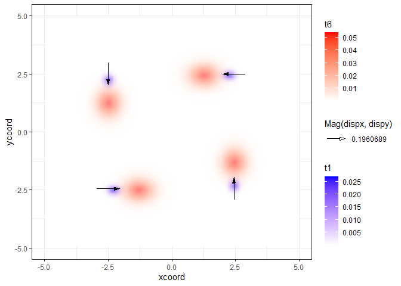

<!-- README.md is generated from README.Rmd. Please edit that file -->

# ICvectorfields

<!-- badges: start -->

<!-- badges: end -->

Vector Fields from Spatial Time Series of Population Abundance

## Overview

Functions for converting time series of spatial abundance or density
data in raster format to vector fields of population movement using the
digital image correlation technique. More specifically, the functions in
the package compute cross-covariance using discrete fast Fourier
transforms for computational efficiency. Vectors in vector fields point
in the direction of highest two dimensional cross-covariance. The
package has a novel implementation of the digital image correlation
algorithm that is designed to detect persistent directional movement
when image time series extend beyond a sequence of two raster images.

## Installation

You can install the released version of ICvectorfields from
[CRAN](https://CRAN.R-project.org) with:

``` r
install.packages("ICvectorfields")
```

You can install the released version of ICvectorfields from GitHub with:

``` r
install.packages("devtools")
devtools::install_github("goodsman/ICvectorfields")
```

## Example

Here is a demonstration of how the functions in the *ICvectorfields*
package estimate movement and how to produce a vector field using
functions in the package.

``` r
library(ICvectorfields)
library(ggplot2)
library(ggnewscale)
library(metR)
library(terra)
#> terra version 1.2.10
```

One of the key advantages of the functions in *ICvectorfields* over
other R software that uses cross-correlation or cross-covariance to
estimate displacement is that the functions in *ICvectorfields* can
estimate displacement in multiple, and opposing directions
simultaneously. To demonstrate this capability a simulated data set was
produced using a convection reaction equation, which is a partial
differential equation with a diffusion term, an advection term for
directed movement and a reaction term. Advection in the simulation was
spatially variable: In the upper left quadrant of the spatial domain,
advection was to the bottom of the domain, in the lower left quadrant,
advection was to the right, in the lower right quadrant, advection was
toward the top of the domain, and in the upper right quadrant, advection
was to the left (see figure below). In all cases the speed of advection
was 0.2 spatial units per unit time.

``` r
# import simulated data
data(SimData, package = "ICvectorfields")

# convert to raster stack
SimStack <- ICvectorfields::RastStackData(SimData)

# confirming dimension
dim(SimStack)
#> [1] 203 203   6
```

Because speed is constant in the simulation model, the *DispFieldST*
function is appropriate for estimating orthogonal velocity vectors:

``` r
VFdf2 <- DispFieldST(SimStack, lag1 = 1, factv1 = 101, facth1 = 101, restricted = TRUE)
VFdf2
#>   rowcent colcent frowmin frowmax fcolmin fcolmax     centx     centy
#> 1      51      51       1     101       1     101 -2.499878  2.499878
#> 2     152      51     102     202       1     101 -2.499878 -2.450861
#> 3      51     152       1     101     102     202  2.450861  2.499878
#> 4     152     152     102     202     102     202  2.450861 -2.450861
#>        dispx      dispy
#> 1  0.0000000 -0.1960689
#> 2  0.1960689  0.0000000
#> 3 -0.1960689  0.0000000
#> 4  0.0000000  0.1960689
```

The movement speed is estimated as 0.196 units of space per unit time in
each of the quadrants and the directions are consistent with simulated
advection directions. Note that in the function above, the logical
restricted argument is set to TRUE, whereas the default is FALSE. The
restricted argument restricts the search for cross-covariance to areas
within each of the grids that are designated using the factv1, and
facth1 arguments to the function when set to TRUE. When restricted is
set to false the algorithm searches the entire spatial domain to look
for maximum cross-covariance. The estimated speed is a little under the
simulated advection speed of 0.2 spatial units per unit time in all
directions. The bias in the estimate is likely due to the diffusion term
in the partial differential equation as diffusion obfuscates the impact
of advection.

To plot vector fields produced by functions in *ICvectorfields* one can
use ggplot2, and its extensions in the metR, and ggnewscale packages:

``` r
SimVF = ggplot() +
  xlim(c(-5, 5)) +
  ylim(c(-5, 5)) +
  geom_raster(data = SimData,
              aes(x = xcoord, y = ycoord, fill = t1)) +
  scale_fill_gradient(low = "white", high = "blue", na.value = NA) +
  new_scale("fill") +
  geom_raster(data = SimData,
              aes(x = xcoord, y = ycoord, fill = t6), alpha = 0.5) +
  scale_fill_gradient(low = "white", high = "red", na.value = NA) +
  geom_vector(data = VFdf2, 
              aes(x = centx, y = centy, 
                  mag = Mag(dispx, dispy), 
                  angle = Angle(dispx, dispy))) + 
  theme_bw()
SimVF
#> Warning: Removed 403 rows containing missing values (geom_raster).

#> Warning: Removed 403 rows containing missing values (geom_raster).
```


